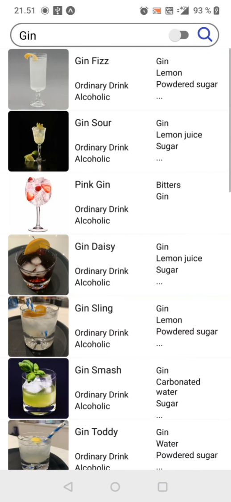
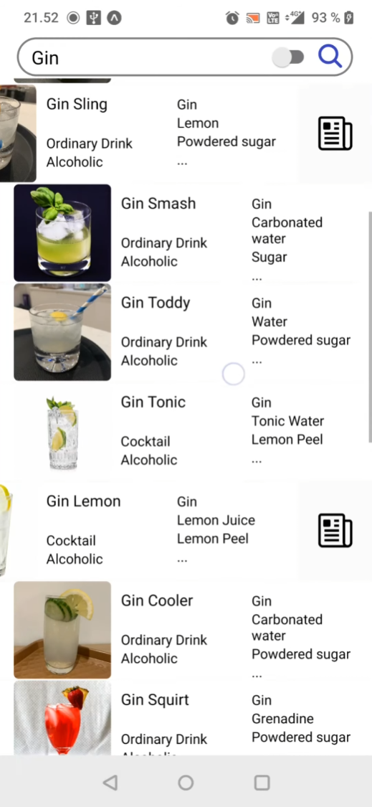
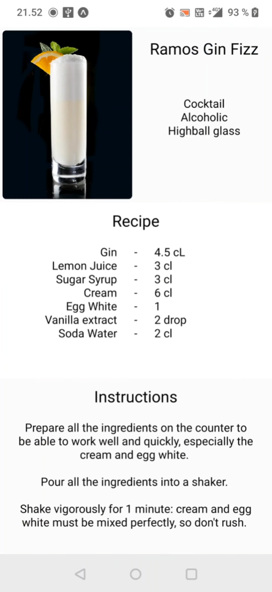
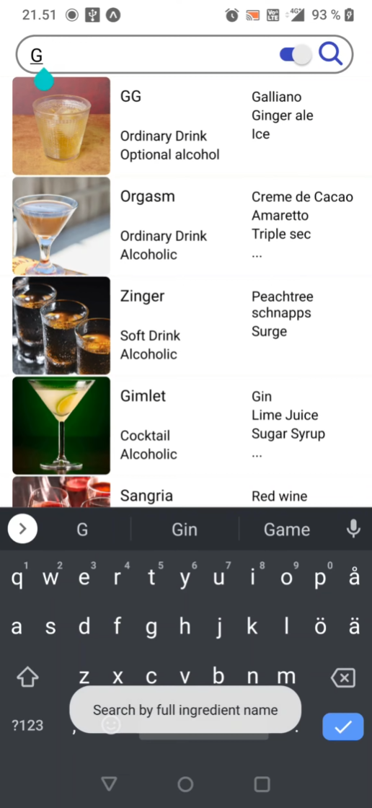
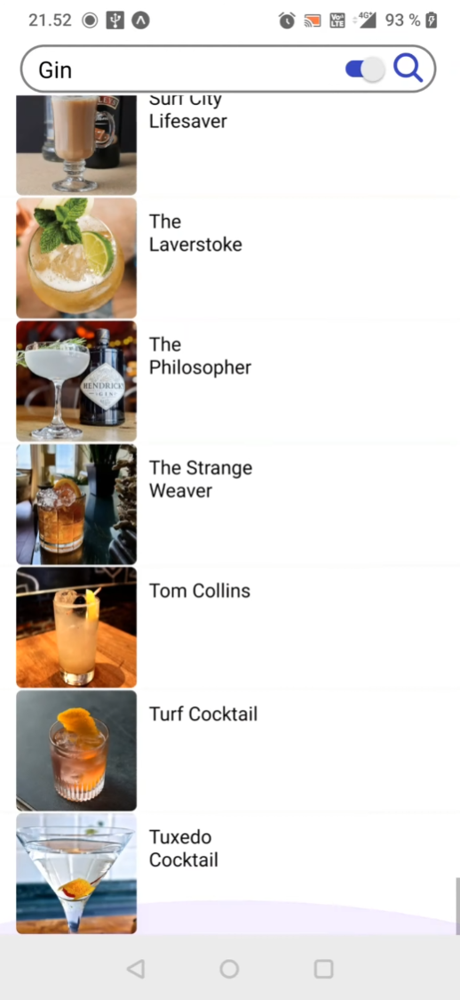

# CocktailDB

<h2>About</h2>
This application is made by Jong Lau for Haaga-Helias mobile programming course as a course project work. The project uses an API from https://www.thecocktaildb.com/ which has hundreds of drinks with recipes. The API can search at maximum 25 drinks by name, while if searching using ingredient it returns much more drinks but with no recipe. For more information about the API, you can look at the website itself.

 
My application is made to have a very clean and minimalistic look with the features to search drinks by name or by ingredient. It has phone functionalities like: pushing the enter/continue button on your phones keyboard will also activate the search button, a swipe functionality on each row that will reveal a button which returns a page of full ingredient list and instructions on the recipe of the chosen drink. Lastly whn toggling the switch to search by name or ingredient a small toaster popup will appear to notify if you're searching by name or ingredient.

 
<h2>Scrapped Features</h2>
The application was supposed to also feature a favourite list which takes the favourited drinks from the main drink list into a firebase database.
Another feature was a login, logout, register feagure which was also supposed to work with firebase.
But after a long time of troubleshooting, I could not get firebase working and time was running out, so I had to ship the application out without these features.
There is also a phone feature that was scrapped, which is the backbutton functionality. It just did not behave as I wanted.

 
<h1>Opening application and search by name</h1>

 

 
<h1>Swipe functionality and full drink details</h1>

 

 
<h1>Search by ingredient</h1>

 
